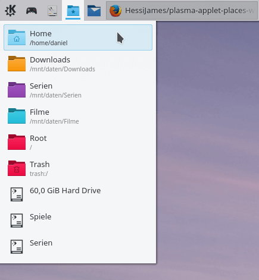

# plasma-applet-places-widget
Plasma 5 widget that gives access to user places



## Depends on
plasma-workspace >= 5.6  
plasma-framework-devel

## Installation
```
git clone https://github.com/HessiJames/plasma-applet-places-widget
cd plasma-applet-places-widget
mkdir build
cd build
cmake -DCMAKE_INSTALL_PREFIX=/usr ..
make
sudo make install
```
